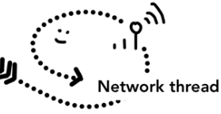

== Browser Process

=== !

[%step]
--
* UI Thread
--
[%step]
--
* Network Thread
--
[%step]
--
* Storage Thread
--

=== UI Thread

[.notes]
--
Network Thread je te passe la main
--

=== Network Thread

[.notes]
--
NIC Network Interface Card,
ARP IP MAC
IP Internet Protocol
--

[%step]
--
Mise en place de protocoles comme la résolution DNS (Domain Name System)
--
[%step]
--
Etablissement d'une connexion TLS (Transport Layer Security)
--

=== !

[.notes]
--
Network Thread je te passe la main
--

[%step]
--
Lecture des entêtes (redirection, mime type)
--
[%step]
--
SafeBrowsing ou Cross Origin Block (CORB)
--

=== Storage thread

Contrôle d'accès aux fichiers stockés dans le navigateur.

=== !

[.browser-process.browser-process-left]

=== !

[.browser-process.browser-process-right]

=== !

[.browser-process.browser-process-left]

=== !

[.browser-process.browser-process-left]

=== !

[.browser-process.browser-process-up]

=== !

[.browser-process.browser-process-left]

=== !

[.browser-process.browser-process-right]

=== !

[.browser-process.browser-process-down]

=== !

[.browser-process.browser-process-right]

=== !

[.browser-process.browser-process-left]
