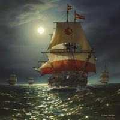

== Cap sur le WEB

=== !

[.notes]
--
3 octobre 1492:
Mais où est donc la terre ? Je suis inquiet. Les marins sont nerveux, ils ont peur de manquer de vivres, ils complotent.

9 octobre 1492:
Je triche sur les calculs, je leur fais croire que nous n'avons parcouru qu'un peu de chemin...
--
image::../images/navigateur.png[width=300, align=center]

=== !

[.notes]
--
14 octobre 1492:
4 heures du matin, sur la Pinta qui est loin devant, le canon tonne, TERRE!
--

