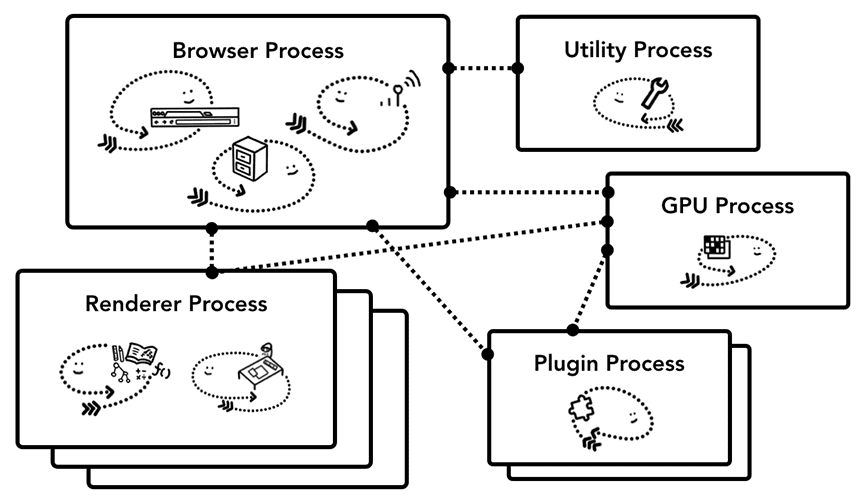
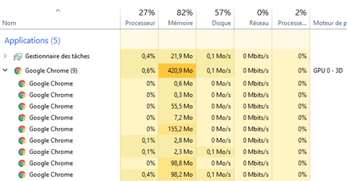

== Chrome Architecture

=== !

[.notes]
--
Utility Process?
GPU gère les tâches GPU en dehors des processus.
PluginProcessus gère tous les plugins.
Renderer qui va nous intéresser.
--

=== !

[.notes]
--
L'architecture multi-processus s'adapte à la machine
--

image::../images/multi-process.svg[]

=== !

