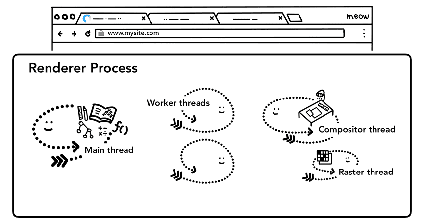
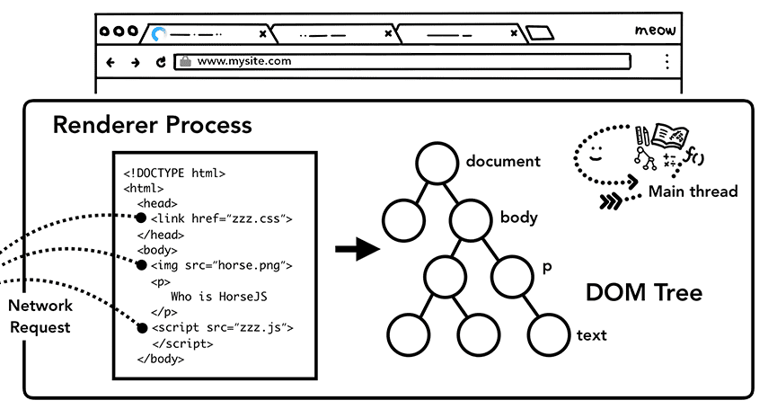
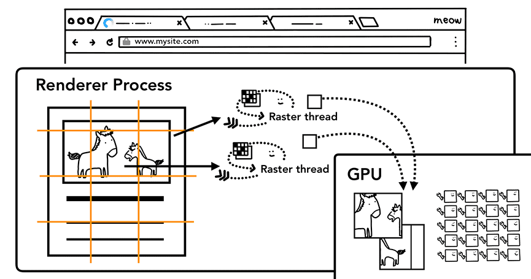

== Renderer Process

=== !

=== !

==== worker thread

[%step]
--
Tout simplement le thread du service worker.
--

[.notes]
--
Permet de mettre en cache des informations etc
--

=== Main thread

=== !

==== Analyse et construction du DOM

[%step]
--
L'avantage avec le code HTML, c'est qu'il ne génère jamais d'erreur.
--

=== !

==== Chargement des sous-ressources

=== !

=== !

==== Calcul de la feuille de style

=== !

==== Mise en page

[.notes]
--
process recursif qui ne s'arrête que lorsque toute la page est clean.

https://www.youtube.com/watch?v=ZTnIxIA5KGw
--

[%step]
--
Tâche extrêmement difficile et coûteuse
--

=== !

==== Peinture

[%step]
--
Il ne s'agit pas de juste "Peindre".
--

=== Comment on pourrait optimiser ce traitement ?

=== !

[%step]
--
Compositor Thread
--
[%step]
--
Raster Thread
--

=== !

=== !

==== Compositor Thread

